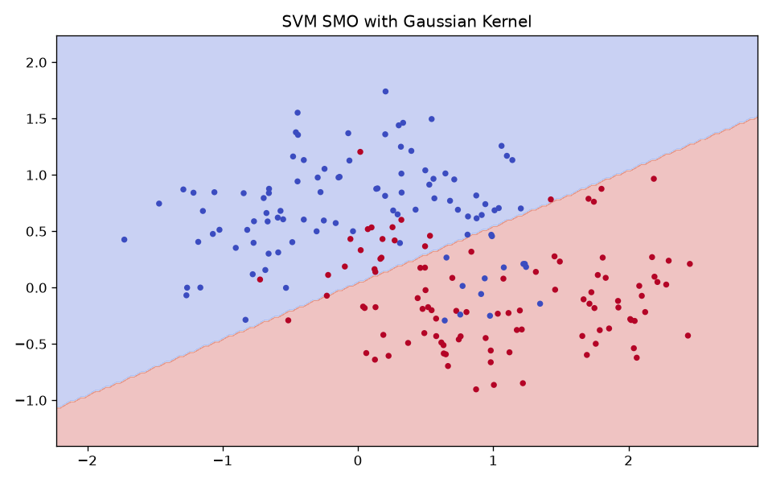

# SVM by SMO

- 实现：[SVCSMO.py](SVCSMO.py)
- 示例：[testSVM-SMO.py](testSVM-SMO.py)
- 数据：[small_data](small_data)
- 依赖：NumPy
- 支持 Python 3 / NumPy 2

## 快速运行

```bash
python testSVM-SMO.py
```

## 结果图


